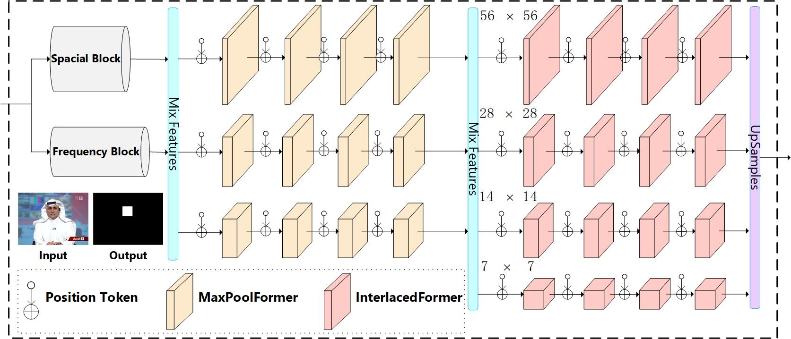

<h1 align="center">
A More General Tampering Localization of Fake Videos
</h1>

## 📜 Directory

- [Introduction](#-introduction)
- [MarkerNet](#-markernet)
- [Train or Test](#-train-or-test)
- [Downloads](#-downloads)
  - [Download Models and Datasets](#download-models-and-datasets)
  - [DFTL Dataset Samples](#dftl-dataset-samples)
  - [DAVIS2016-TL Dataset Samples](#davis2016-tl-dataset-samples)
  - [VSTL Dataset Samples](#vstl-dataset-samples)

## ✨ Introduction

Nowadays, advanced video editing tools and generation methods produce tampered videos more realistically. The deepfakes and object-based fake videos have been widely spread over the Internet. At present, various forgery detection methods have achieved high performance. However, these detection methods are only effective against one type of forgery, and have little effect against unseen videos. To solve this challenging problem, we propose a more general forgery detection method named MarkerNet. MarkerNet works well with three different types of forgery: deepfakes, video inpainting and video splicing. It also works well with unknown fake videos. MarkerNet has two important components that are the spatial features extraction module and the frequency features extraction module, to enhance spatial-frequency features. The spatial module uses three operators as CNN filters: Sobel, Spatial Rich Model (SRM) and Laplacian. The spatial module also contains RGB features of videos to remain the original information. The frequency module uses three different scale DCT features and the full-scale DCT features. Specifically, the MarkerNet detects fake videos in three stages: 1) First, learning spatial and frequency features of videos by twin-bottleneck CNN filters. 2) Then, learning the local features of videos by three scales MaxPoolFormer modules. 3) Next, learning the long-range and short-range context features of videos by four scales InterlacedFormer modules. Finally, fusing the four scales features and output the suspect regions. Extensive experiments on datasets of three forgery scenarios have shown that our proposed method is superior to the related state-of-the-art methods. In particular, the performance of cross-datasets mode is significant and outstanding.  Our code and data are available at \url{https://github.com/lajlksdf/MarkerNet}

## 👀️ MarkerNet

<div align="center">
    
</div>

## 🔬 Train or Test

**Train**

```apache
python train.py --local_rank=0 --set_path=x --type=inpainting --pretrained=x
```

**Test**

```apache
python test.py --local_rank=0 --set_path=x --type=inpainting --pretrained=x
```

## 🚀️ Downloads

### Download Models and Datasets

**Pretrained models, and related datasets**


| Item         | Link                                                                     | Comments                                                         |
| -------------- | -------------------------------------------------------------------------- | ------------------------------------------------------------------ |
| All Models   | [BaiduNetdisk](https://pan.baidu.com/s/1OI0RulNKIHJBVCnxHNsuYg?pwd=fh72) | code：fh72                                                       |
| VSTL         | [BaiduNetdisk](https://pan.baidu.com/s/1FXU-nShsODhD_U9neCcfEw?pwd=7o08) | code: 7o08  Cite from[ViTHash](https://arxiv.org/abs/2112.08117) |
| DFTL         | [BaiduNetdisk](https://pan.baidu.com/s/1sK1CfBJy_qMvPOVJkW1mXA?pwd=eaj0) | code: eaj0  Cite from[ViTHash](https://arxiv.org/abs/2112.08117) |
| DAVIS2016-TL | [BaiduNetdisk](https://pan.baidu.com/s/1h1fu-P-pac5akQpZGNItMw?pwd=ande) | code: ande Cite from[ViTHash](https://arxiv.org/abs/2112.08117)  |

### Samples

[dirs](./asset)

**Predict**

```apache
python predict_video.py --file_path=./asset/video-splicing/ --pretrained=./models/vstl/vstl.pth 
```

```apache
python predict_video.py --file_path=./asset/video-inpainting/ --pretrained=./models/inpainting/in.pth 
```

```apache
python predict_video.py --file_path=./asset/f2f/ --pretrained=./models/face2face/f2f.pth 
```
